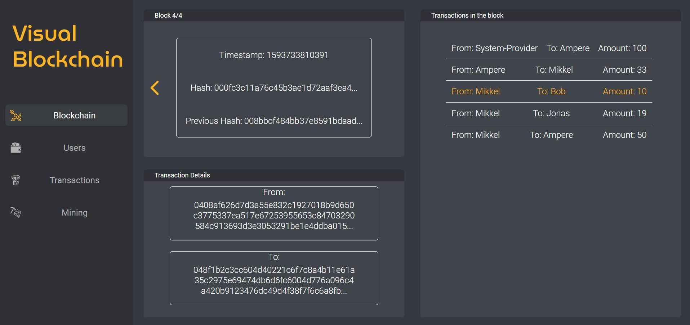
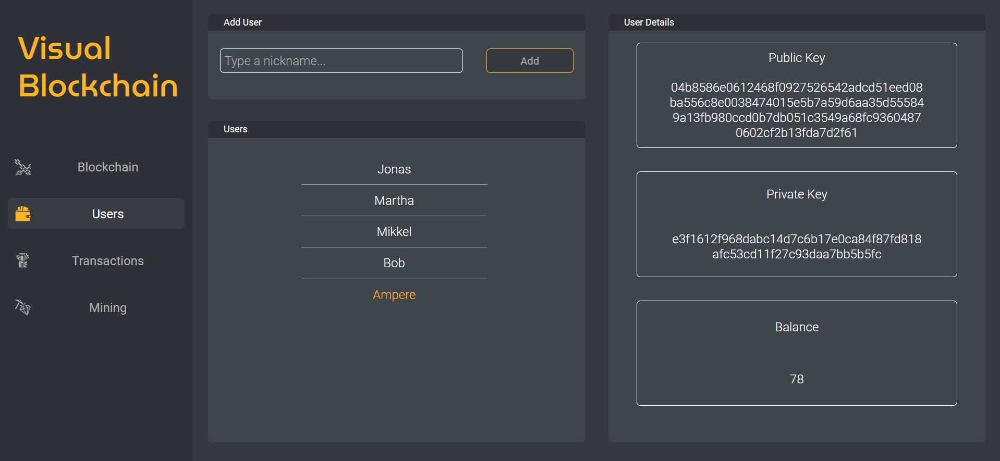
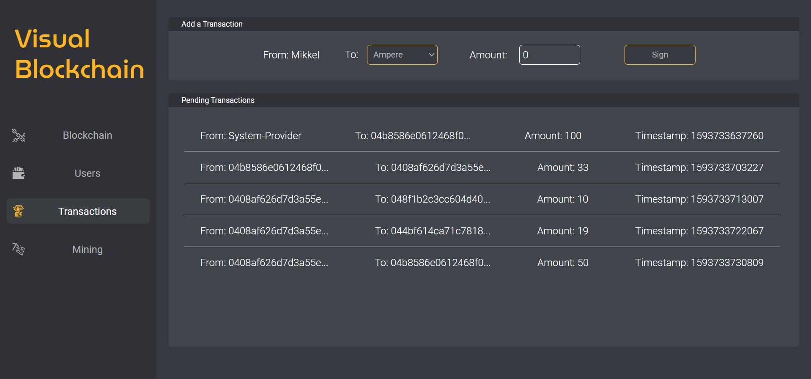
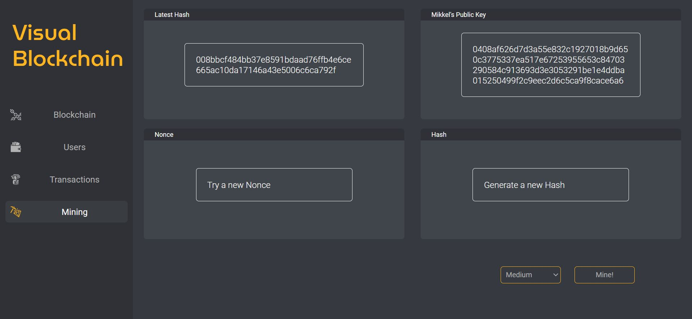

<h1 align="center">
Sorting Visualizer</h1>

  <a href="#-tecnologias">Tecnologias</a>&nbsp;&nbsp;&nbsp;|&nbsp;&nbsp;&nbsp;
  <a href="#-projeto">Projeto</a>&nbsp;&nbsp;&nbsp;|&nbsp;&nbsp;&nbsp;
  <a href="#-como-usar">Como Usar</a>&nbsp;&nbsp;&nbsp;|&nbsp;&nbsp;&nbsp;
  <a href="#-como-contribuir">Como contribuir</a>

  

  

  

  

## 🚀 Tecnologias

Esse projeto foi desenvolvido com as seguintes tecnologias:

- [ReactJs](https://reactjs.org/) (_Flux_ _Pattern_)
- JavaScript
- HTML5
- CSS

## 💻 Projeto

O projeto consiste em uma aplicação que simula algumas das funcionalidades essenciais na tecnologia de blockchain aplicada a criptomoedas. O modelo para a implementação do blockchain é baseado nas aulas oferecidas por [Xavier Decuyper](https://www.youtube.com/channel/UCnxrdFPXJMeHru_b4Q_vTPQ/featured).

#### Blockchain

Na aba Blockchain o usuário pode visualizar os blocos que constituem o blockchain, incluindo todas as transações contidas em cada bloco.

#### Users

Na aba Users o usuário pode criar carteiras digitando um nickname que gerará automaticamente um endereço público ao qual as transações podem ser direcionadas. É tambem possível verificar o crédito de cada carteira. Tal crédito é consequência da análise de todas as transações contidas no blockchain até o momento.

#### Transactions

Em Transactions é possível assinar transações entre usuários que serão adicionadas ao próximo bloco a ser minerado. Cada transação contem uma assinatura única que a identifica, de acordo com o endereço da carteira que envia a quantia e os demais detalhes da transação.

#### Mining

Em Mining o usuário pode simular o ato de minerar um novo bloco, cumprindo um proof-of-work para a criação da nova hash. Ao minerar o bloco o usuário recebe uma recompensa.

## 🔥 Como usar

- É necessário ter o [Node.js](https://nodejs.org/en/) e [npm](https://www.npmjs.com/) instalados
- Clone esse repositório: `https://github.com/romaSilva/Visual-Blockchain.git`
- Instale as dependências do projeto, digitando no terminal: `npm install`
- Enfim, para rodar a aplicação digite: `npm start`

### ou:

- [https://sorting-visual.herokuapp.com/](https://sorting-visual.herokuapp.com/)

## ♻️ Como contribuir

- Faça um fork desse repositório;
- Cria uma branch com a sua feature: `git checkout -b minha-feature`;
- Faça commit das suas alterações: `git commit -m 'feat: Minha nova feature'`;
- Faça push para a sua branch: `git push origin minha-feature`.

Depois que o merge da sua pull request for feito, você pode deletar a sua branch.
